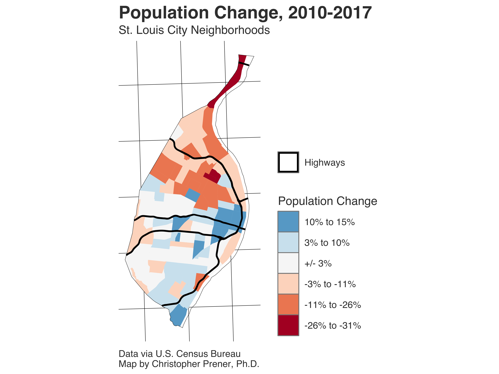

# STL_DEMOGRAPHY_NhoodChange

### Abstract
This repository contains a map image of neighborhoods in St. Louis, Missouri, colored by the estimated poopulation change between 2010 and 2017. See my [dataviz gallery](https://chris-prener.github.io/dataviz/project/stl-pop-change/) for additional details.

### Preview

### Citing These Images
This repository is associated with a [Digital Object Identifier](https://en.wikipedia.org/wiki/Digital_object_identifier) (or DOI). Please include the DOI when citing these images. You can find pre-formatted citations and a BibTeX entry, among other citation resources, on the associated [Zenodo release page]().

## About Christopher Prener, Ph.D.
Chris is an urban and medical sociologist with an interest in mixed methods research designs that incorporate spatial data. His dissertation examined the effect of neighborhood context and conditions on emergency medical services work, particularly with patients who have mental illnesses or substance use disorders. He is also part of a research team examining the effects of literacy on mental health service use and recovery, and his student research team is documenting the effects of systemic street closures in St. Louis. He is an Assistant Professor in the Department of Sociology and Anthropology at Saint Louis University. More details are available at [his website](https://chris-prener.github.io) and he can be contacted at [chris.prener@slu.edu](mailto:chris.prener@slu.edu).
